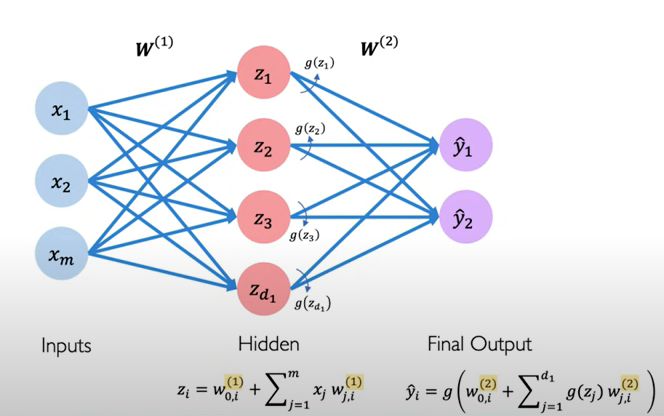
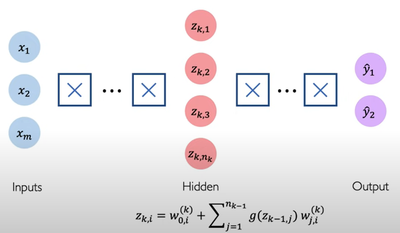

# From Perceptron to Deep Nerual Networks

.PNG>)

### Perceptron and forward propagation

Perceptron is a single layer neural network and a basic building block of deep nerual networks (DNN). The first component of it is **"input nodes".** they has one bias or numerical variables on each node as like the inputs in machine learning algorithms. Next, with weights on each input node, you will use **linear combination of inputs and weights**. Finally, the combination will turn into the estimated output in a **"output node"** through one of **non-linear activation functions**.

What I descripbed so far is the process of **forward propagation** in a perceptron, which is the way of inferencing output from input.

> input nodes -> linear combination of input nodes to weights (preactivation) -> applying non-linear activation function (activation) -> output node

It is said that the reason perceptron is designed to use forward propagation is to mimic the mechanism of neruals in our brain. In addition to that, it is also reasonable in the fact that the forward propagation make the back propagation, the learning method of nerual networks, easy to get the gradients efficiently.&#x20;

the nerual network can vary depending on the type of activation function, the number of input nodes, the number of output nodes, the number of weights and perceptron is not enough to understand various types of deep nerual networks. However, this concept of perceptron shows how deep neural networks inference output that we want to predict, classify, estimate.&#x20;

### Multiple layered perceptron (Neural Network)

Introducing multiple layers of perceptron, you can build **multi layered perceptron** which is neural **networks**. how many layers you put into your neural networks decides the number of hidden layers which is the layers between input layer and output layer. The basic neural network is Single Layer Neural Network like below image. There are additional weights and hidden nodes, and the forward propagation regime is consistently used through the network but pipelined.

### Deep Neural Networks

if you stack more than one layer into your neural networks, it becomes deep neural networks.

The deeper layers you create, The complicate relationship between input and output you can describe. However, how to decide the number of hidden layers is very hard and complicate question. It is no wonder because even a single layer neural network has a power to approximate any relationship between input and output according to Universal Approximation Theorem. Therefore, at the first place, it seems there is no reason to put more than one layer. ([https://en.wikipedia.org/wiki/Universal\_approximation\_theorem](https://en.wikipedia.org/wiki/Universal\_approximation\_theorem))


**Universal Approximation Theorem**\
****\
**"A feedforward network with a single layer is sufficient to approximate, to an arbitrary precision, any continuous function"**



Feedforward Neural Network

A form of acyclic neural network.



### Reference

[https://www.youtube.com/watch?v=5tvmMX8r\_OM\&t=841s\&ab\_channel=AlexanderAmini](https://www.youtube.com/watch?v=5tvmMX8r\_OM\&t=841s\&ab\_channel=AlexanderAmini)

